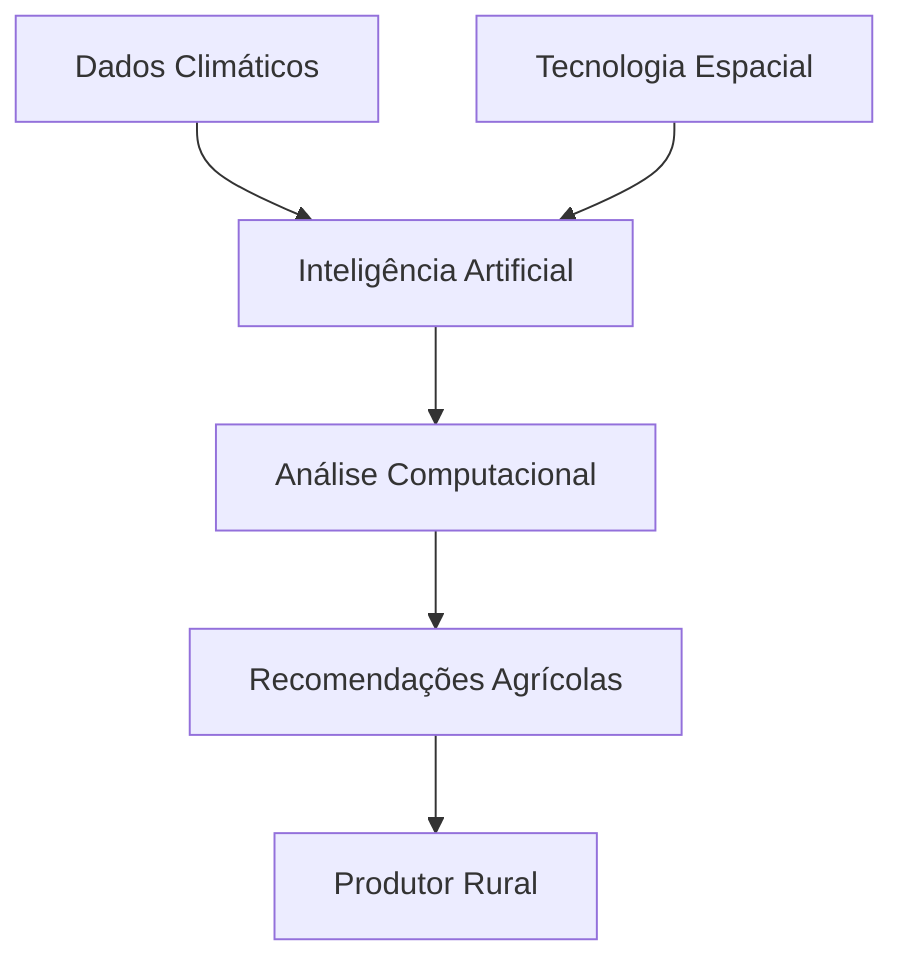

<div align="center">


<br>


<br><br>


</div>

---

# Sobre o Projeto

<table>
<tr>
<td width="60%">

O **TerraLink** é uma solução tecnológica inspirada na ciência aeroespacial.

O projeto propõe adaptar modelos computacionais e tecnologias desenvolvidas para planejamento agrícola em Marte e aplicá-los na agricultura brasileira, principalmente em regiões de clima extremo como o Semiárido Nordestino.

A ideia central do projeto é utilizar tecnologias criadas para os ambientes mais hostis conhecidos pela ciência para resolver problemas reais enfrentados na Terra.

</td>

<td align="center">

```txt
      .
   .       .
    🚀
 .        *
      .       .
  🪐        🌎
```

</td>
</tr>
</table>

---

# O Problema

```txt
• Escassez hídrica
• Irregularidade de chuvas
• Desertificação
• Baixa previsibilidade climática
• Perda de produtividade agrícola
```

Enquanto isso, a ciência aeroespacial investe continuamente em sistemas capazes de prever e otimizar a produção de alimentos em ambientes extremos como Marte.

O TerraLink nasce justamente da conexão entre esses dois cenários.

---

# A Solução

O aplicativo TerraLink utiliza:

- Inteligência Artificial
- Modelagem Computacional
- Processamento Climático
- Ciência de Dados
- Tecnologias Aeroespaciais

para auxiliar produtores rurais na tomada de decisões mais eficientes, sustentáveis e resilientes.

---

<div align="center">

# Tecnologias Utilizadas

<br>


<br><br>

<table>
<tr>
<td align="center" width="200">


### Java  
IntelliJ IDEA

</td>

<td align="center" width="200">


### Oracle SQL

</td>

<td align="center" width="200">


### HTML  
### CSS  
### JavaScript

</td>
</tr>

<tr>
<td align="center" width="200">


### IBM Watson  
### Node.js

</td>

<td align="center" width="200">


### Python  
### VS Code

</td>

<td align="center" width="200">


### Git  
### GitHub  
### Figma

</td>
</tr>
</table>

</div>

---

# Estrutura Tecnológica



---

# Futuras Implementações

```txt
• Integração com dados meteorológicos
• Monitoramento via satélite
• Dashboard analítico
• Sistema de alertas climáticos
• Recomendações automatizadas com IA
• Aplicação mobile
• Geolocalização agrícola
```

---

<div align="center">

# Equipe

Projeto desenvolvido para o Challenge FIAP.

<br>

### Guilherme Almeida  
### [Adicionar integrantes]

<br><br>


</div>
