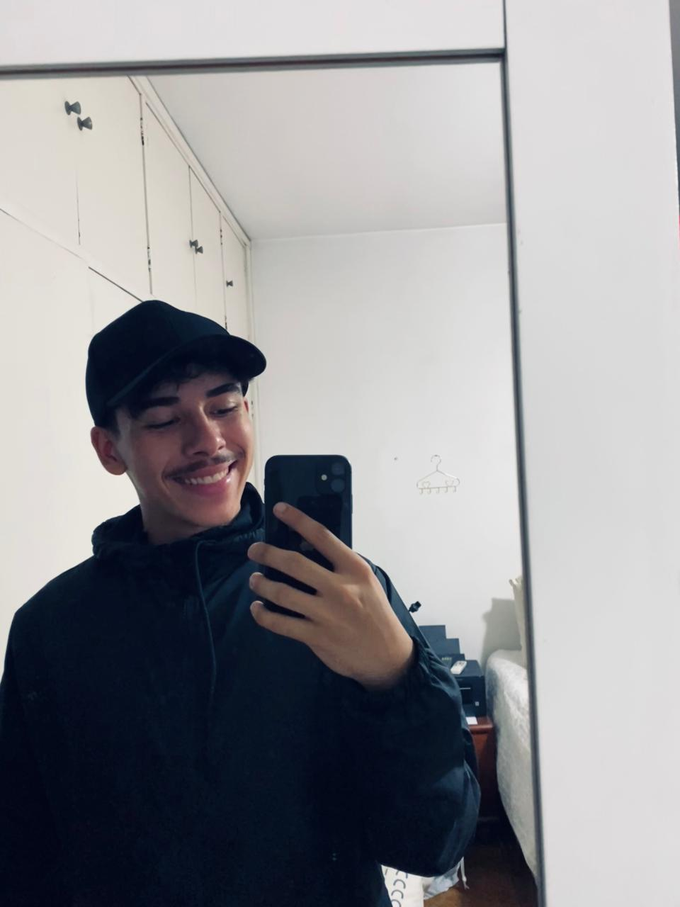
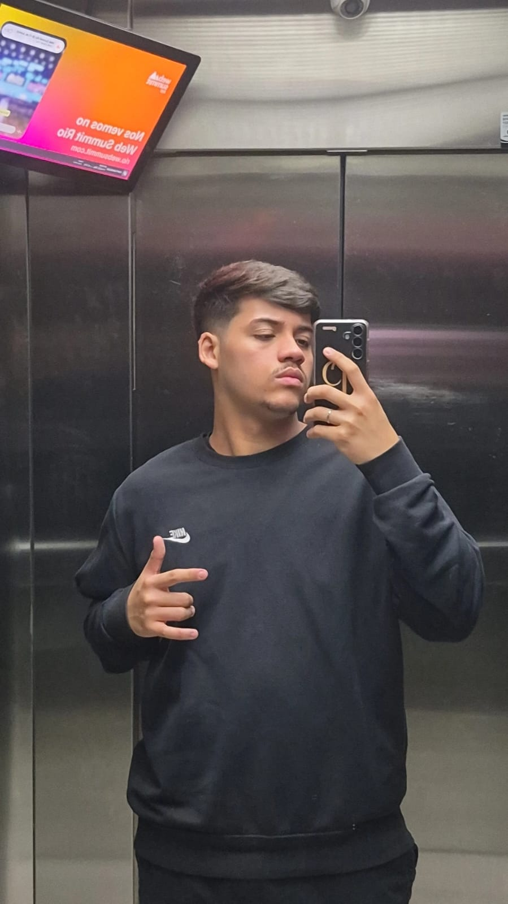
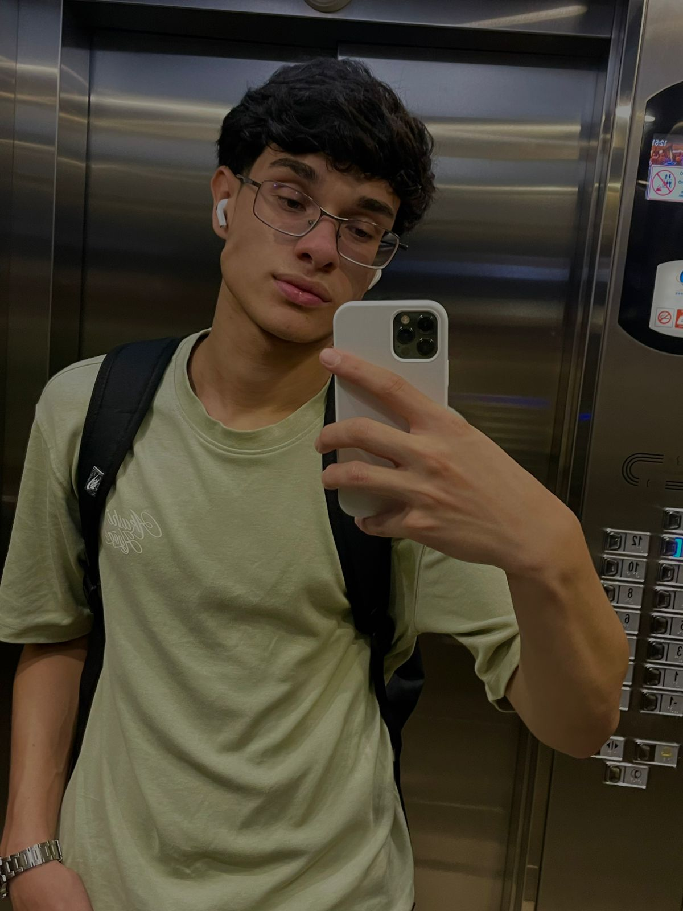
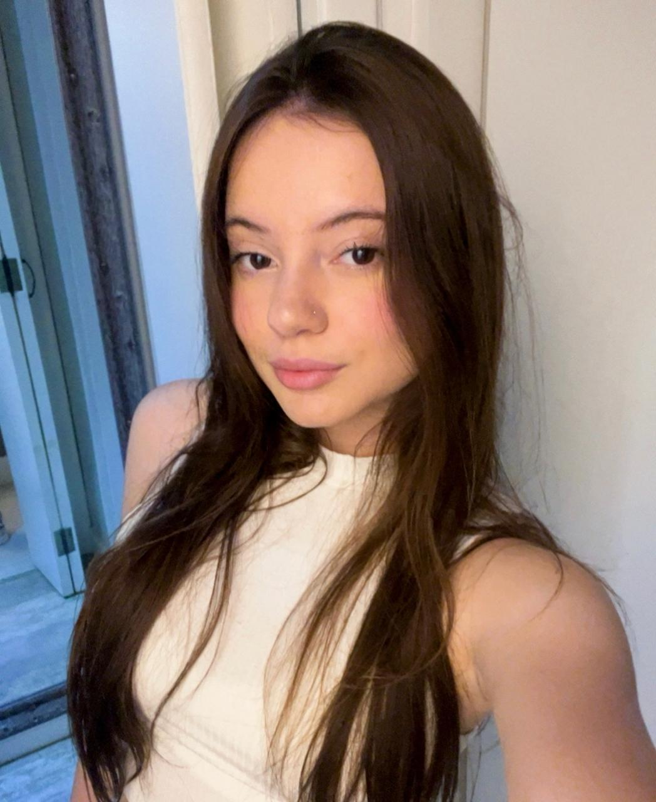
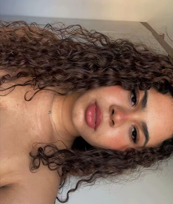

  

  

---

<h2>TerraLink</h2>

O **TerraLink** é uma plataforma que conecta visão computacional, inteligência artificial e dados climáticos para apoiar decisões no agronegócio. A proposta nasce da inspiração em tecnologias aeroespaciais: observar grandes áreas, interpretar sinais ambientais e transformar dados complexos em recomendações úteis para produtores rurais.

A ideia é simples: usar uma camada inteligente de análise para aproximar o campo de uma central de missão, onde cada indicador ajuda a entender solo, clima, risco hídrico, produtividade e estabilidade ambiental.

---

<h2>Tela Do App</h2>

<table>
  <tr>
    <td width="50%" align="center" valign="top">
      <h3>Orbital Farm Control</h3>
      
<b>Status:</b> monitoramento ativo

      
<b>Área analisada:</b> zona agrícola conectada

      
<b>Missão:</b> prever riscos, otimizar recursos e proteger a produção.

    </td>
      <h3>Alertas Inteligentes</h3>
      
Instabilidade climática detectada

      
Recomendação de uso eficiente de água

      
Lavoura com bom potencial produtivo

      
Nova leitura ambiental processada

       
      <h3>Próxima Ação</h3>
      
Gerar análise preditiva e enviar recomendações para o produtor.

    </td>
  </tr>
</table>

---

<h2>Recursos</h2>

  

  

Análises inteligentes para apoiar decisões no campo, otimizar recursos naturais e aumentar a previsibilidade da produção agrícola.

---

<h2>Tecnologias</h2>

  

---

<h2>Equipe</h2>

<table>
  <tr>
    <td align="center" width="20%">
      
       <b>Guilherme Almeida</b>
       Java
    </td>
    <td align="center" width="20%">
      
       <b>Leonardo da Silva</b>
       Front-End
    </td>
    <td align="center" width="20%">
      
       <b>Thiago Rodrigues</b>
       Python
    </td>
    <td align="center" width="20%">
      
       <b>Geovanna Secchi</b>
       Database
    </td>
    <td align="center" width="20%">
      
       <b>Beatriz Urbano</b>
       Artificial Intelligence
    </td>
  </tr>
</table>

  

